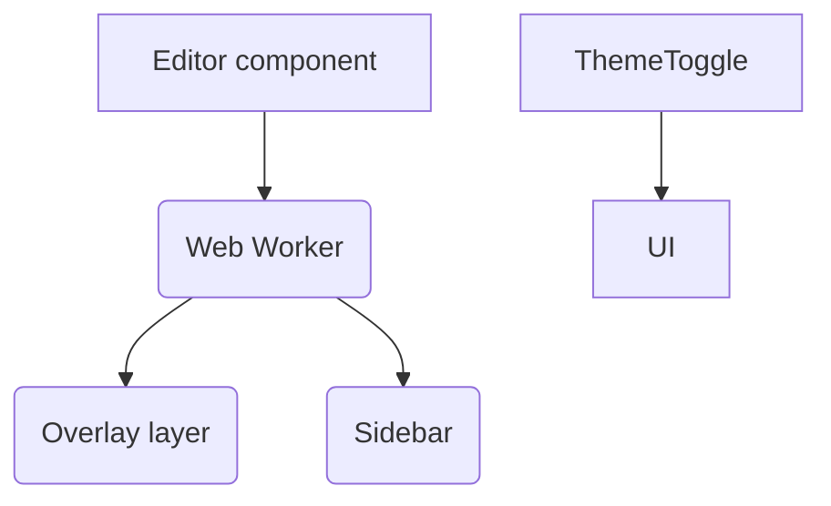

# Hemingway Editor Clone – Development Plan

## 1. Overview
This plan describes the approach, milestones, and quality practices to build the intranet-hosted Hemingway Editor clone per PRD.

## 2. Technology Stack
| Layer | Choice | Rationale |
|-------|--------|-----------|
| Language | TypeScript (strict) | Safety & refactorability |
| Framework | React + Vite | Fast dev server, modern build |
| Styling | Tailwind CSS | Utility-first, fast styling |
| UI Library | shadcn/ui | Accessible, Tailwind-compatible components |
| State | React Context + useReducer | Simple global state needs |
| Text Analysis | Pure functions + Web Worker | Keeps UI responsive |
| Testing | Jest, React Testing Library, Cypress | Unit + integration + E2E |
| Linting/Format | ESLint, Prettier | Code quality |
| CI/CD | GitHub Actions | Lint, test, build on push |

## 3. Architecture

### Modules
1. core/analysis – pure functions (tokenize, grade, rule checks).  
2. workers/analyzer.ts – wraps analysis in Web Worker.  
3. components/Editor.tsx – textarea / contentEditable.  
4. components/HighlightOverlay.tsx – positions colored spans.  
5. components/StatsPanel.tsx – readability + counts.  
6. components/Toolbar.tsx – mode switch, import/export, theme.

All components isolated and unit-tested.

## 4. Development Process
1. **Initialization**
   - Scaffold project with Vite + React + Tailwind + shadcn.
   - Configure ESLint, Prettier, Jest, Cypress, Husky pre-commit.
2. **Test-Driven Development (TDD)**
   - For each rule (adverb, passive voice, etc.) write failing unit tests first, then implement.
   - Edge cases: punctuation, multiline, non-English.
3. **Feature Iterations**
   - Iteration 1: Core editor (no analysis) + tests.
   - Iteration 2: Analysis engine (passive, adverbs) + sidebar metrics.
   - Iteration 3: Highlight overlay with colors & toggle.
   - Iteration 4: Import/Export, clipboard, theme switch.
   - Iteration 5: Performance tuning with Web Worker.
   - Iteration 6: Accessibility polish, dark mode visuals.
4. **Quality Gates**
   - >90 % unit coverage.
   - All lint & type checks pass.
   - Cypress E2E: load, write, highlight, export.
5. **Deployment**
   - Build static bundle (`vite build`).
   - Package as zip for IT to host on IIS/Apache.
6. **Maintenance**
   - SemVer versioning.
   - Dependabot (internal mirror) for updates.
   - Quarterly audit for accessibility & performance.

## 5. Timeline (Indicative)
| Week | Deliverable |
|------|-------------|
| 1 | Project scaffold, CI pipeline |
| 2 | Editor component, import/export |
| 3 | Analysis engine w/ two rules |
| 4 | Full rule set, stats panel |
| 5 | Highlight overlay, theme switch |
| 6 | Performance optimization, E2E tests |
| 7 | Accessibility, polish, docs |
| 8 | UAT & intranet deployment |

## 6. Roles & Responsibilities
- Lead Dev – architecture, code reviews.
- Front-end Dev(s) – feature implementation, testing.
- QA Engineer – test plan, Cypress suites.
- UX Designer – ensure readability of colors/themes.
- IT Admin – deploy, monitor.

## 7. Communication & Git Workflow
- Trunk-based with short-lived feature branches.
- PR template includes checklist for tests, docs.
- Slack channel #hemingway-clone for async updates.
- Weekly stand-up.

## 8. Risk Management
See PRD table; add build/CI failures mitigated by green-only merges.

## 9. Approval
Sign-off required from Product Owner & IT before deployment. 